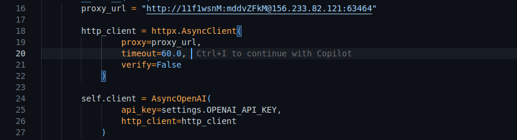

# UZNETIX ADVISOR

bot/ --Bu yerda botga tegishli bo'lgan fayylar bor---
    handlers/---Bu yerda handlerlar joylashgan---
        admin.py/
        interview.py/
        start.py/
    keyboards/---Keybordlar joylashgan folder---
        inline.py/
    middlewares/---Kerakli middleware lar mavjud---
        database.py/
    utils/
        text_utils.py/
    database/---Database ga aloqador hammasi shu folderda---
        engine.py
        models.py
        repositories.py
    migrations/---Alembic migrations joylari

    services/--Bu bizda servies filelari--
        ai_service.py (Bu yerda GPT bilan intigratsiya qilingan barcha funksiyalar shu yerda bu yerda siz proxyni promntlarni o'zgartrishingiz mumkin
        
            !!!ESLATMA!!!  
            PROMPTNI O'ZGARTIRISHINGIZ BOSHQA FILE LARGA TASIR KO'RSATISHI MUMKIN INTERVIEW COMPLATE DOIM QAYTARISH KERAK!!!
        )
        getcourse.py(
            BU FILE DA UZNETIX.COM DAN VERIFICATION DAN O'TKAZISH UCHUN KERAK BO'LADI
        )

##O'rnatish uchun

1) Postgresql database o'rnating va database yarating migration qiling 
 (Шаг 1: Обновление списка пакетов
	sudo apt update

Шаг 2: Установка PostgreSQL
	sudo apt install postgresql postgresql-contrib -y

Шаг 3: Запуск службы PostgreSQL
	sudo systemctl start postgresql

Шаг 4: Автозапуск PostgreSQL при перезагрузке
	sudo systemctl enable postgresql

Шаг 5: Вход в консоль PostgreSQL
	sudo -u postgres psql
	
	Вы увидите: Приглашение командной строки изменится на postgres=#
	
	CREATE DATABASE back_remove;
	
	\q

Шаг 6:

	alembic revision --autogenerate -m "new tables"
	alembic upgrade head
    
    )

2) Venv yarating (python3 -m venv venv)

3) Activate qiling (
    source venv/bin/activate 
    )

4) Kerakli kutbxonalarni o'rnating (
    pip install -r requirements.txt
)

5) Ishga tushurish (
    python3 -m bot.main
)

